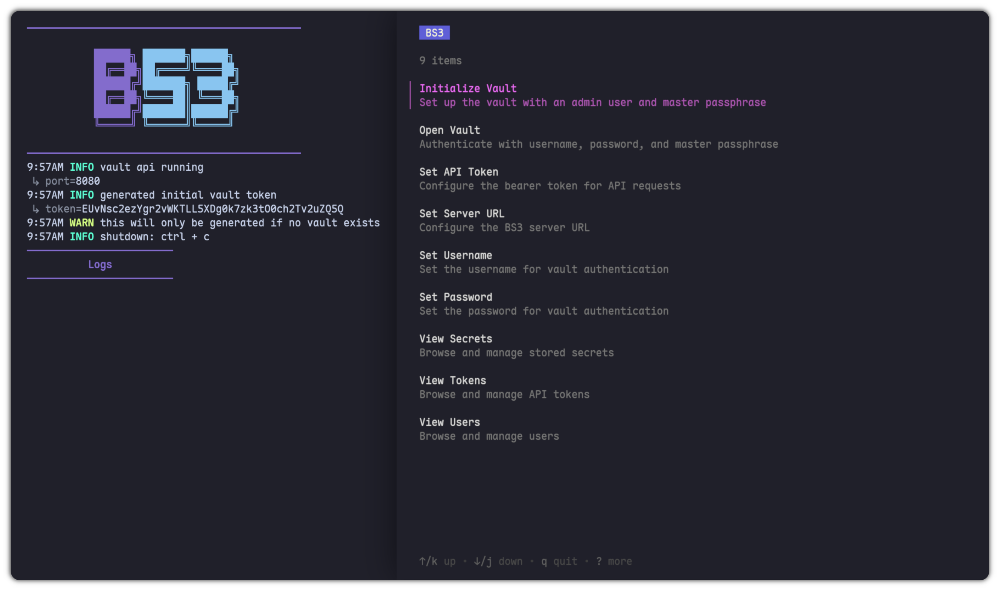

<p align="center">
  
</p>

<p align="center">
  A self-hosted secrets vault for homelabbers who want real encryption without the enterprise price tag.
</p>

<p align="center">
  
</p>

<p align="center">
  
  
  
  
</p>

---

## Table of Contents

- [What is BS3?](#what-is-bs3)
- [How It Works](#how-it-works)
  - [Vault Lifecycle](#vault-lifecycle)
  - [Encryption Model](#encryption-model)
  - [Authentication](#authentication)
- [API Reference](#api-reference)
  - [Example Workflow](#example-workflow)
- [Installation](#installation)
  - [Docker Compose (Recommended)](#docker-compose-recommended)
  - [Build from Source (Server)](#build-from-source-server)
  - [Build Docker Image](#build-docker-image)
- [Configuration](#configuration)
- [CLI Tool](#cli-tool)
  - [Install the CLI](#install-the-cli)
  - [Configuration](#configuration-1)
  - [TUI](#tui)
  - [Vault Lifecycle](#vault-lifecycle-1)
  - [Secrets](#secrets)
  - [Tokens](#tokens)
  - [Users](#users)
  - [Config](#config)
- [Development](#development)
- [Security Notes](#security-notes)

---

## What is BS3?

**BS3** is a lightweight, self-hosted secret management server and CLI built for homelab environments. It exposes a REST API backed by a SQLite database and uses the same **envelope encryption** strategy employed by tools like HashiCorp Vault and AWS Secrets Manager — but without the complexity or cost.

Secrets are encrypted at rest with AES-256-GCM. The master key never touches disk. Authentication supports both HTTP Basic Auth and HMAC-signed Bearer tokens with optional TTL expiration.

> **Intended for homelab use.** If you're currently shoving secrets into `.env` files, this is for you.

---

## How It Works

### Vault Lifecycle

The vault operates in three states:

```
Uninitialized  →  POST /initvault  →  Locked  →  POST /openvault  →  Unlocked
```

| State | Description |
|---|---|
| **Uninitialized** | No database exists. A one-time Bearer token is printed to stdout for bootstrapping. |
| **Locked** | Database exists but the master key is not in memory. Vault must be opened with the master passphrase before secrets can be accessed. |
| **Unlocked** | Master key is held in memory (RAM only — never written to disk). Secrets can be read and written. |

### Encryption Model

BS3 uses **envelope encryption**:

1. Each secret is encrypted with a unique, randomly generated **DEK** (Data Encryption Key) using AES-256-GCM.
2. The DEK is itself encrypted with the **master key** and stored alongside the ciphertext.
3. The master key is derived at runtime from the master passphrase + salt using **Argon2id** — it is never persisted anywhere.

```
Secret → [AES-256-GCM, DEK] → Encrypted Secret
DEK    → [AES-256-GCM, Master Key] → Encrypted DEK
Master Key ← Argon2id(passphrase + salt) — lives in RAM only
```

If someone steals the database, they get encrypted blobs and encrypted DEKs. Without the master key (which is never stored), nothing is readable.

### Authentication

All API routes are protected by `authMiddleware`, which supports two methods:

- **Bearer Token** — HMAC-SHA256 token keyed with the master key, transmitted as base64url. Supports optional TTL expiration.
- **HTTP Basic Auth** — Username + Argon2-hashed password stored in the `users` table.

---

## API Reference

| Method | Path | Auth | Description |
|---|---|---|---|
| `POST` | `/initvault` | Initial token | Initialize vault with username, password, and master passphrase |
| `POST` | `/openvault` | Basic Auth | Unlock vault with master passphrase |
| `GET` | `/token?name=X&ttl=N` | Basic Auth | Generate a named Bearer token (TTL in seconds, optional) |
| `DELETE` | `/deletetoken?name=X` | Bearer or Basic | Delete a named token |
| `GET` | `/listtokens` | Bearer or Basic | List all tokens |
| `POST` | `/store` | Bearer or Basic | Store a named secret |
| `GET` | `/get?name=X` | Bearer or Basic | Retrieve a secret by name |
| `DELETE` | `/delete?name=X` | Bearer or Basic | Delete a secret by name |
| `GET` | `/listsecrets` | Bearer or Basic | List all secret names with timestamps |
| `POST` | `/adduser` | Bearer or Basic | Add a user |
| `DELETE` | `/deleteuser?username=X` | Bearer or Basic | Delete a user |
| `GET` | `/listusers` | Bearer or Basic | List all users |

### Example Workflow

```bash
# 1. Start the server — grab the one-time init token from stdout

# 2. Initialize the vault
curl -X POST http://localhost:8080/initvault \
  -H "Authorization: Bearer <init-token>" \
  -H "Content-Type: application/json" \
  -d '{"username":"admin","password":"mypassword","master_passphrase":"mysuperpassphrase"}'

# 3. Open the vault after any restart
curl -X POST http://localhost:8080/openvault \
  -u admin:mypassword \
  -H "Content-Type: application/json" \
  -d '{"master_passphrase":"mysuperpassphrase"}'

# 4. Store a secret
curl -X POST http://localhost:8080/store \
  -u admin:mypassword \
  -H "Content-Type: application/json" \
  -d '{"name":"db_password","secret":"hunter2"}'

# 5. Retrieve a secret
curl http://localhost:8080/get?name=db_password \
  -u admin:mypassword

# 6. Generate a Bearer token (1 hour TTL)
curl "http://localhost:8080/token?name=ci_token&ttl=3600" \
  -u admin:mypassword
```

---

## Installation

### Docker Compose (Recommended)

```yaml
services:
  bs3-server:
    image: bs3-server:latest
    ports:
      - "8080:8080"
    volumes:
      - bs3-data:/data
    restart: unless-stopped

volumes:
  bs3-data:
```

The `/data` volume persists your encrypted database (`vault.db`) and salt file (`vault_salt`). Mount it to keep your vault across container restarts.

### Build from Source (Server)

```bash
git clone https://github.com/bkenks/BS3.git
cd BS3/server

go build -o bs3-server ./cmd
./bs3-server
./bs3-server --verbose   # enable debug logging
```

### Build Docker Image

```bash
docker build -t bs3-server .
```

The image uses a multi-stage build — only the compiled binary ends up in the final Alpine-based image (~10 MB).

---

## Configuration

| Method | Variable | Default | Description |
|---|---|---|---|
| Env var | `VAULT_API_PORT` | `8080` | Port the server listens on |
| Flag | `--verbose` | off | Enable debug-level logging |

---

## CLI Tool

BS3 ships with a companion CLI for interacting with the server. It supports both a standard command-line interface and a **TUI** (Terminal User Interface).

### Install the CLI

Requires Go and git. Builds from source and installs to `~/.local/bin/bs3`:

```bash
curl -fsSL https://raw.githubusercontent.com/bkenks/BS3/main/cli-tool/scripts/installer.sh | sh
```

If `~/.local/bin` isn't on your `$PATH`, add this to your shell config (`~/.bashrc`, `~/.zshrc`, etc.):

```bash
export PATH="$HOME/.local/bin:$PATH"
```

### Configuration

The CLI reads connection settings from `~/.config/bs3/bs3.env` (created and managed by `bs3 set`). You can also export these as environment variables directly.

| Variable | Description |
|---|---|
| `BS3_SERVER_URL` | URL of the BS3 server (e.g. `http://localhost:8080`) |
| `BS3_AUTH_METHOD` | `token` (default) or `basic` |
| `BS3_API_TOKEN` | Bearer token — used when `BS3_AUTH_METHOD=token` |
| `BS3_USERNAME` | Username — used when `BS3_AUTH_METHOD=basic` |
| `BS3_PASSWORD` | Password — used when `BS3_AUTH_METHOD=basic` |

```bash
# Quickstart: configure with token auth
bs3 set serverurl http://localhost:8080
bs3 set apitoken <your-token>

# Or use basic auth
bs3 set serverurl http://localhost:8080
bs3 set authmethod basic
bs3 set username admin
bs3 set password mypassword
```

### TUI

```bash
bs3 tui    # Launch the interactive terminal UI
```

### Vault Lifecycle

```bash
bs3 initvault <username> <password> <master_passphrase>
# Initialize a fresh vault. Run once with the one-time init token
# printed to the server's stdout.

bs3 openvault <master_passphrase>
# Unlock the vault after a server restart. Requires BS3_USERNAME
# and BS3_PASSWORD to be set (uses Basic Auth).
```

### Secrets

```bash
bs3 store <name> <value>          # Store a secret
bs3 get <name>                    # Print a secret value to stdout
bs3 delete <name>                 # Delete a secret
bs3 listsecrets                   # List all secrets with timestamps
```

#### Inject secrets into a process

`envject` fetches secrets from the vault and injects them as environment variables into the given command. Secret names are uppercased as env var keys.

```bash
bs3 envject <secret1> [secret2...] -- <command> [args...]

# Example: run a Node app with DB_PASSWORD and API_KEY injected
bs3 envject db_password api_key -- node server.js
```

#### Write secrets to a tmpfs env file

`writeenv` fetches secrets and writes them as `KEY=VALUE` pairs to `/dev/shm/bs3-<prefix>.env` (tmpfs, mode `0600`). Useful for passing secrets to tools that expect a `.env` file without touching disk.

```bash
bs3 writeenv <prefix> <secret1> [secret2...]
# Writes to /dev/shm/bs3-<prefix>.env and prints the path

bs3 rmenv <prefix>
# Deletes /dev/shm/bs3-<prefix>.env

# Example
bs3 writeenv myapp db_password api_key
# → /dev/shm/bs3-myapp.env
# DB_PASSWORD=hunter2
# API_KEY=abc123
```

### Tokens

```bash
bs3 generatetoken <name> [ttl_seconds]
# Generate a Bearer token. ttl_seconds=0 means no expiry.
# Prints the token name, value, and expiry.

bs3 deletetoken <name>    # Delete a token
bs3 listtokens            # List all tokens with expiry info
```

### Users

```bash
bs3 adduser <username> <password>    # Add a new user
bs3 deleteuser <username>            # Delete a user
bs3 listusers                        # List all users with creation timestamps
```

### Config

```bash
bs3 set serverurl <url>          # Set BS3_SERVER_URL
bs3 set apitoken <token>         # Set BS3_API_TOKEN
bs3 set username <username>      # Set BS3_USERNAME
bs3 set password <password>      # Set BS3_PASSWORD
bs3 set authmethod <token|basic> # Set BS3_AUTH_METHOD
```

All `set` commands write to `~/.config/bs3/bs3.env`.

---

## Development

```bash
# Run tests
go test ./...

# Run a specific test
go test ./internal/cryptoutil/... -run TestFunctionName

# Lint
go vet ./...
```

### Project Structure

| File | Purpose |
|---|---|
| `cmd/main.go` | Entry point: flag parsing, vault state check, HTTP server, graceful shutdown |
| `internal/api/api.go` | All HTTP handlers and auth middleware |
| `internal/vault/vault.go` | Vault struct, DB operations, secret CRUD |
| `internal/cryptoutil/cryptoutil.go` | Argon2id, AES-GCM, HMAC token generation |
| `internal/constants/constants.go` | File paths and env var names |

---

## Security Notes

- The master key is **never written to disk** — it lives in RAM only and is gone when the process stops.
- Each secret has its own unique DEK — a compromised secret does not expose others.
- Passwords are hashed with **Argon2id** before storage.
- Bearer tokens are **HMAC-SHA256** signed with the master key and optionally time-limited.
- TLS is not built in — put BS3 behind a reverse proxy (e.g. Caddy, Nginx) if you need HTTPS.

> If you spot a security issue, open a pull request or issue. Contributions are welcome.

---

*BS3 — Because `.env` files aren't a secrets strategy.*
