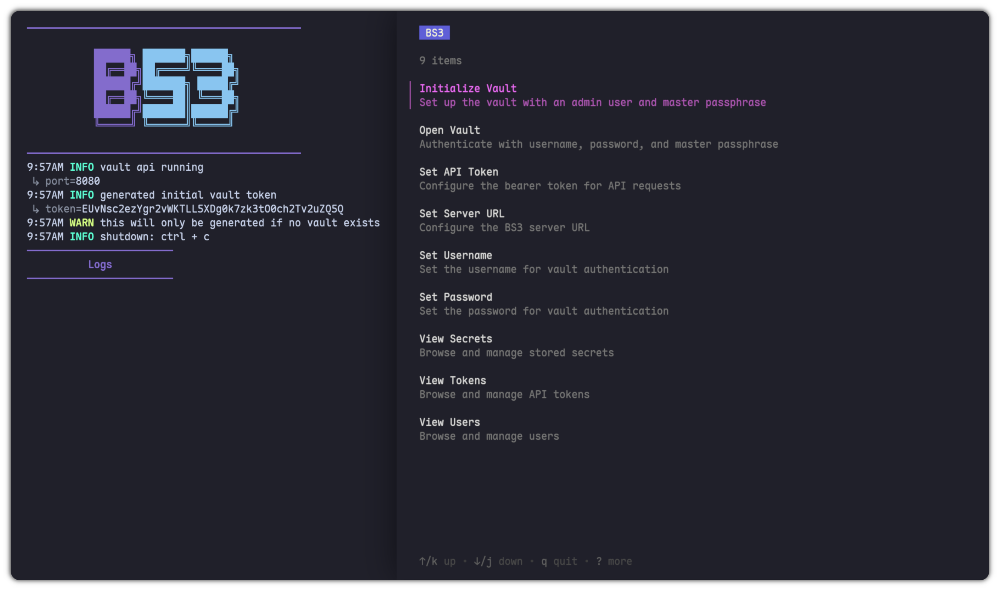

<p align="center">
  <picture>
    <source media="(prefers-color-scheme: dark)" srcset=".github_assets/bs3_Dark_BG-w_Full_Title.svg">
    <source media="(prefers-color-scheme: light)" srcset=".github_assets/bs3_Light_BG-w_Full_Title.svg">
    
  </picture>
</p>

<p align="center">
  A self-hosted secrets vault for homelabbers who want real encryption without the enterprise price tag.
</p>

<p align="center">
  
</p>

<p align="center">
  
  
  
  
</p>

---

## Table of Contents

- [Table of Contents](#table-of-contents)
- [What is BS3?](#what-is-bs3)
- [How It Works](#how-it-works)
  - [Vault Lifecycle](#vault-lifecycle)
  - [Encryption Model](#encryption-model)
  - [Authentication](#authentication)
- [API Reference](#api-reference)
  - [Example Workflow](#example-workflow)
- [Server Deployment](#server-deployment)
  - [Local Testing (Docker)](#local-testing-docker)
  - [Releasing a Production Image](#releasing-a-production-image)
  - [Production Deployment](#production-deployment)
  - [Build From Source](#build-from-source)
- [Configuration](#configuration)
- [CLI Tool](#cli-tool)
  - [Install the CLI](#install-the-cli)
  - [Configuration](#configuration-1)
  - [TUI](#tui)
  - [Vault Lifecycle](#vault-lifecycle-1)
  - [Secrets](#secrets)
    - [Organize secrets into folders](#organize-secrets-into-folders)
    - [Inject secrets into a process](#inject-secrets-into-a-process)
    - [Write secrets to a tmpfs env file](#write-secrets-to-a-tmpfs-env-file)
  - [Tokens](#tokens)
  - [Users](#users)
  - [Config](#config)
- [Development](#development)
  - [Project Structure](#project-structure)
- [Security Notes](#security-notes)

---

## What is BS3?

**BS3** is a lightweight, self-hosted secret management server and CLI built for homelab environments. It exposes a REST API backed by a SQLite database and uses the same **envelope encryption** strategy employed by tools like HashiCorp Vault and AWS Secrets Manager — but without the complexity or cost.

Secrets are encrypted at rest with AES-256-GCM. The master key never touches disk. Authentication supports both HTTP Basic Auth and HMAC-signed Bearer tokens with optional TTL expiration. Secrets can be organized into optional, free-text **folders** for grouping.

> **Intended for homelab use.** If you're currently shoving secrets into `.env` files, this is for you.

---

## How It Works

### Vault Lifecycle

The vault operates in three states:

```
Uninitialized  →  POST /initvault  →  Locked  →  POST /openvault  →  Unlocked
```

| State             | Description                                                                                                                          |
| ----------------- | ------------------------------------------------------------------------------------------------------------------------------------ |
| **Uninitialized** | No database exists. A one-time Bearer token is printed to stdout for bootstrapping.                                                  |
| **Locked**        | Database exists but the master key is not in memory. Vault must be opened with the master passphrase before secrets can be accessed. |
| **Unlocked**      | Master key is held in memory (RAM only — never written to disk). Secrets can be read and written.                                    |

### Encryption Model

BS3 uses **envelope encryption**:

1. Each secret is encrypted with a unique, randomly generated **DEK** (Data Encryption Key) using AES-256-GCM.
2. The DEK is itself encrypted with the **master key** and stored alongside the ciphertext.
3. The master key is derived at runtime from the master passphrase + salt using **Argon2id** — it is never persisted anywhere.

```
Secret → [AES-256-GCM, DEK] → Encrypted Secret
DEK    → [AES-256-GCM, Master Key] → Encrypted DEK
Master Key ← Argon2id(passphrase + salt) — lives in RAM only
```

If someone steals the database, they get encrypted blobs and encrypted DEKs. Without the master key (which is never stored), nothing is readable.

### Authentication

All API routes are protected by `authMiddleware`, which supports two methods:

- **Bearer Token** — HMAC-SHA256 token keyed with the master key, transmitted as base64url. Supports optional TTL expiration.
- **HTTP Basic Auth** — Username + Argon2-hashed password stored in the `users` table.

---

## API Reference

| Method   | Path                     | Auth            | Description                                                     |
| -------- | ------------------------ | --------------- | --------------------------------------------------------------- |
| `POST`   | `/initvault`             | Initial token   | Initialize vault with username, password, and master passphrase |
| `POST`   | `/openvault`             | Basic Auth      | Unlock vault with master passphrase                             |
| `GET`    | `/token?name=X&ttl=N`    | Basic Auth      | Generate a named Bearer token (TTL in seconds, optional)        |
| `DELETE` | `/deletetoken?name=X`    | Bearer or Basic | Delete a named token                                            |
| `GET`    | `/listtokens`            | Bearer or Basic | List all tokens                                                 |
| `POST`   | `/store`                 | Bearer or Basic | Create a secret in a folder (409 if that name already exists there) |
| `POST`   | `/editsecret`            | Bearer or Basic | Update an existing secret's value (404 if it doesn't exist)     |
| `GET`    | `/get?name=X&folder=Y`   | Bearer or Basic | Retrieve a secret by name within a folder                       |
| `DELETE` | `/delete?name=X&folder=Y`| Bearer or Basic | Delete a secret by name within a folder                         |
| `GET`    | `/listsecrets`           | Bearer or Basic | List all secret names with timestamps and folders              |
| `GET`    | `/listfolders`           | Bearer or Basic | List all folders with a count of secrets in each               |
| `POST`   | `/createfolder`          | Bearer or Basic | Create an empty folder (409 if it already exists)              |
| `POST`   | `/movesecret`            | Bearer or Basic | Move a secret between folders (409 if the destination is taken) |
| `POST`   | `/adduser`               | Bearer or Basic | Add a user                                                      |
| `DELETE` | `/deleteuser?username=X` | Bearer or Basic | Delete a user                                                   |
| `GET`    | `/listusers`             | Bearer or Basic | List all users                                                  |

### Example Workflow

```bash
# 1. Start the server — grab the one-time init token from stdout

# 2. Initialize the vault
curl -X POST http://localhost:8080/initvault \
  -H "Authorization: Bearer <init-token>" \
  -H "Content-Type: application/json" \
  -d '{"username":"admin","password":"mypassword","master_passphrase":"mysuperpassphrase"}'

# 3. Open the vault after any restart
curl -X POST http://localhost:8080/openvault \
  -u admin:mypassword \
  -H "Content-Type: application/json" \
  -d '{"master_passphrase":"mysuperpassphrase"}'

# 4. Create a secret in a folder (fails with 409 if it already exists there)
curl -X POST http://localhost:8080/store \
  -u admin:mypassword \
  -H "Content-Type: application/json" \
  -d '{"name":"db_password","secret":"hunter2","folder":"production"}'

# 5. Retrieve a secret (name + folder)
curl "http://localhost:8080/get?name=db_password&folder=production" \
  -u admin:mypassword

# 5b. Update an existing secret's value
curl -X POST http://localhost:8080/editsecret \
  -u admin:mypassword \
  -H "Content-Type: application/json" \
  -d '{"name":"db_password","folder":"production","secret":"hunter3"}'

# 6. List folders with secret counts
curl http://localhost:8080/listfolders \
  -u admin:mypassword

# 7. Generate a Bearer token (1 hour TTL)
curl "http://localhost:8080/token?name=ci_token&ttl=3600" \
  -u admin:mypassword
```

---

## Server Deployment

The server ships as a Docker image. Releasing and deploying are separate steps:
`dev/scripts/release.sh` **publishes** an image to the GitHub Container Registry
(GHCR), and your production Compose file **consumes** it.

### Local Testing (Docker)

`server/compose/compose.dev.yml` builds the image straight from your working
tree — uncommitted changes included — so you can test before publishing:

```bash
docker compose -f server/compose/compose.dev.yml up --build   # build local source, run on :8080
docker compose -f server/compose/compose.dev.yml down         # stop and remove the container
```

### Releasing a Production Image

The server and CLI version **independently** — releases are tagged
`server/vX.Y.Z` and `cli/vX.Y.Z` so each ships on its own schedule.

`dev/scripts/release.sh` cuts a server release. Pass the version (and
`--prerelease` for a pre-release):

```bash
docker login ghcr.io   # once — username + a PAT with write:packages
./dev/scripts/release.sh 1.2.3                # stable release
./dev/scripts/release.sh 1.3.0-rc --prerelease   # pre-release
```

It builds the image for **multiple architectures** (`linux/amd64` +
`linux/arm64`) via `buildx`, pushes `ghcr.io/bkenks/bs3-server:1.2.3` (plus
`:latest` for a stable release), then creates a GitHub release `server/v1.2.3`
whose notes link the image. `gh` (the GitHub CLI) must be installed and
authenticated.

Multi-platform matters: building on an ARM Mac with a plain `docker build`
produces an ARM-only image that won't run on an `amd64` Linux server. The image
uses a multi-stage build — only the compiled binary ends up in the final
Alpine-based image (~10 MB).

> Both releases can also be cut from the `bs3dev` hub (**Server › Release** /
> **CLI › Release**), which prompts for the version and stable/pre-release.

### Production Deployment

On the server host, deploy with a Compose file that **pulls** the published
image:

```yaml
services:
  bs3-server:
    image: ghcr.io/bkenks/bs3-server:latest
    ports:
      - "8080:8080"
    volumes:
      - bs3-data:/data
    restart: unless-stopped

volumes:
  bs3-data:
```

```bash
docker compose pull && docker compose up -d
```

The `/data` volume persists the encrypted database (`vault.db`) and salt file
(`vault_salt`) across restarts. TLS is not built in — put BS3 behind a reverse
proxy (Caddy, Nginx) for HTTPS.

### Build From Source

To run the server without Docker:

```bash
git clone https://github.com/bkenks/BS3.git
cd BS3/server
GOWORK=off go build -o bs3-server ./cmd
./bs3-server              # or: ./bs3-server --verbose
```

`GOWORK=off` builds the `server` module in isolation against its own
`go.mod`/`go.sum`, independent of the repo's `go.work` workspace (the same way
the release and Docker builds resolve dependencies). The server writes its vault
to the hardcoded `/data` directory, so that path must exist and be writable;
Docker (where `/data` is a mounted volume) is the recommended path.

---

## Configuration

| Method  | Variable         | Default | Description                |
| ------- | ---------------- | ------- | -------------------------- |
| Env var | `VAULT_API_PORT` | `8080`  | Port the server listens on |
| Flag    | `--verbose`      | off     | Enable debug-level logging |

---

## CLI Tool

BS3 ships with a companion CLI for interacting with the server. It supports both a standard command-line interface and a **TUI** (Terminal User Interface).

### Install the CLI

**Production install** — requires Go and git; builds the latest stable CLI release and installs to `~/.local/bin/bs3`:

```bash
curl -fsSL https://raw.githubusercontent.com/bkenks/BS3/main/cli-tool/scripts/install.sh | sh
```

The installer builds from the `cli/stable` tag, which each stable CLI release advances. To pin a specific version, set `BS3_CLI_VERSION`:

```bash
curl -fsSL https://raw.githubusercontent.com/bkenks/BS3/main/cli-tool/scripts/install.sh | BS3_CLI_VERSION=0.4.0 sh
```

If `~/.local/bin` isn't on your `$PATH`, add this to your shell config (`~/.bashrc`, `~/.zshrc`, etc.):

```bash
export PATH="$HOME/.local/bin:$PATH"
```

**Local testing** — build from a checkout (`GOWORK=off` builds `cli-tool` in isolation against its own `go.mod`, independent of the repo's `go.work` workspace):

```bash
cd BS3/cli-tool
GOWORK=off go build -o bs3 .      # or run directly: GOWORK=off go run . <args>
```

### Releasing the CLI

`dev/scripts/release-cli.sh` cuts a CLI release — independent of the server:

```bash
./dev/scripts/release-cli.sh 0.4.0                # stable: tags cli/v0.4.0 + advances cli/stable
./dev/scripts/release-cli.sh 0.5.0-rc --prerelease   # pre-release: tag + GitHub release only
```

It creates a GitHub release `cli/v0.4.0`; a stable release also force-moves the `cli/stable` tag so `install.sh` picks it up. Requires an authenticated `gh`.

### Uninstall the CLI

```bash
curl -fsSL https://raw.githubusercontent.com/bkenks/BS3/main/cli-tool/scripts/uninstall.sh | sh
```

### Configuration

The CLI reads connection settings from `~/.config/bs3/bs3.env` (created and managed by `bs3 set`). You can also export these as environment variables directly.

| Variable          | Description                                          |
| ----------------- | ---------------------------------------------------- |
| `BS3_SERVER_URL`  | URL of the BS3 server (e.g. `http://localhost:8080`) |
| `BS3_AUTH_METHOD` | `token` (default) or `basic`                         |
| `BS3_API_TOKEN`   | Bearer token — used when `BS3_AUTH_METHOD=token`     |
| `BS3_USERNAME`    | Username — used when `BS3_AUTH_METHOD=basic`         |
| `BS3_PASSWORD`    | Password — used when `BS3_AUTH_METHOD=basic`         |

```bash
# Quickstart: configure with token auth
bs3 set serverurl http://localhost:8080
bs3 set apitoken <your-token>

# Or use basic auth
bs3 set serverurl http://localhost:8080
bs3 set authmethod basic
bs3 set username admin
bs3 set password mypassword
```

### TUI

```bash
bs3 tui    # Launch the interactive terminal UI
```

The secrets browser works like a file explorer: the top level lists folders
and ungrouped secrets; `enter` opens a folder to see the secrets inside it, and
`esc` walks back up (and out to the main menu from the root). New secrets
default to whichever folder is currently open. Keys: `enter` open · `esc` back ·
`ctrl+n` new secret · `ctrl+d` new folder · `ctrl+e` edit · `ctrl+f` move ·
`ctrl+\` delete · `/` filter.

### Vault Lifecycle

```bash
bs3 initvault <username> <password> <master_passphrase>
# Initialize a fresh vault. Run once with the one-time init token
# printed to the server's stdout.

bs3 openvault <master_passphrase>
# Unlock the vault after a server restart. Requires BS3_USERNAME
# and BS3_PASSWORD to be set (uses Basic Auth).
```

### Secrets

Secrets are addressed as `folder.name` — the text before the first `.` is the
folder, the rest is the secret name. A name with no `.` refers to the
ungrouped/root folder.

```bash
bs3 store <folder.name> <value>     # Create a secret (fails if it already exists)
bs3 edit <folder.name> <value>      # Update an existing secret's value
bs3 get <folder.name>               # Print a secret value to stdout
bs3 delete <folder.name>            # Delete a secret
bs3 listsecrets [folder]            # List secrets (with timestamps and a
                                    # FOLDER column); optionally filter to one folder

# Examples
bs3 store supabase.jwt_key eyJhb...   # secret "jwt_key" in folder "supabase"
bs3 store api_key abc123              # secret "api_key" in the root folder
```

#### Organize secrets into folders

A folder is a free-text tag that groups secrets. The unique key is the
`(name, folder)` pair, so **the same name may exist in different folders** —
`prod.db_password` and `staging.db_password` are two distinct secrets. A secret
with no folder is ungrouped. `store` only ever creates: if a secret with that
name already exists in that folder it fails — use `edit` to change a value.

A folder appears automatically as soon as a secret is tagged with it, but you
can also create an **empty** folder ahead of time with `createfolder` — an
explicitly created folder persists even with zero secrets in it.

```bash
bs3 listfolders                      # List folders and how many secrets each contains
bs3 createfolder <folder>            # Create an empty folder
bs3 movesecret <folder.name> <to_folder>  # Move a secret to another folder
                                           # (empty to_folder moves it to ungrouped/root;
                                           #  fails if the name is taken in to_folder)
```

#### Inject secrets into a process

`envject` fetches secrets from the vault and injects them as environment variables into the given command. The secret name (after the folder) is uppercased as the env var key.

```bash
bs3 envject <folder.name> [folder.name...] -- <command> [args...]

# Example: run a Node app with DB_PASSWORD and API_KEY injected
bs3 envject production.db_password production.api_key -- node server.js
```

#### Write secrets to a tmpfs env file

`writeenv` fetches secrets and writes them as `KEY=VALUE` pairs to `/dev/shm/bs3-<prefix>.env` (tmpfs, mode `0600`). Useful for passing secrets to tools that expect a `.env` file without touching disk.

```bash
bs3 writeenv <prefix> <folder.name> [folder.name...]
# Writes to /dev/shm/bs3-<prefix>.env and prints the path

bs3 rmenv <prefix>
# Deletes /dev/shm/bs3-<prefix>.env

bs3 importenv <input_file> [folder]
# Imports KEY=VALUE pairs from a .env file as secrets.
# The optional [folder] argument imports them all into that folder.
# Secrets that already exist in the target folder are skipped (not overwritten);
# the command reports how many were imported and how many skipped.

# Example
bs3 writeenv myapp production.db_password production.api_key
# → /dev/shm/bs3-myapp.env
# DB_PASSWORD=hunter2
# API_KEY=abc123
```

### Tokens

```bash
bs3 generatetoken <name> [ttl_seconds]
# Generate a Bearer token. ttl_seconds=0 means no expiry.
# Prints the token name, value, and expiry.

bs3 deletetoken <name>    # Delete a token
bs3 listtokens            # List all tokens with expiry info
```

### Users

```bash
bs3 adduser <username> <password>    # Add a new user
bs3 deleteuser <username>            # Delete a user
bs3 listusers                        # List all users with creation timestamps
```

### Config

```bash
bs3 set serverurl <url>          # Set BS3_SERVER_URL
bs3 set apitoken <token>         # Set BS3_API_TOKEN
bs3 set username <username>      # Set BS3_USERNAME
bs3 set password <password>      # Set BS3_PASSWORD
bs3 set authmethod <token|basic> # Set BS3_AUTH_METHOD
```

All `set` commands write to `~/.config/bs3/bs3.env`.

---

## Development

```bash
# Run tests
go test ./...

# Run a specific test
go test ./internal/cryptoutil/... -run TestFunctionName

# Lint
go vet ./...
```

### Project Structure

| File                                | Purpose                                                                      |
| ----------------------------------- | ---------------------------------------------------------------------------- |
| `cmd/main.go`                       | Entry point: flag parsing, vault state check, HTTP server, graceful shutdown |
| `internal/api/api.go`               | All HTTP handlers and auth middleware                                        |
| `internal/vault/vault.go`           | Vault struct, DB operations, secret CRUD                                     |
| `internal/cryptoutil/cryptoutil.go` | Argon2id, AES-GCM, HMAC token generation                                     |
| `internal/constants/constants.go`   | File paths and env var names                                                 |

---

## Security Notes

- The master key is **never written to disk** — it lives in RAM only and is gone when the process stops.
- Each secret has its own unique DEK — a compromised secret does not expose others.
- Passwords are hashed with **Argon2id** before storage.
- Bearer tokens are **HMAC-SHA256** signed with the master key and optionally time-limited.
- TLS is not built in — put BS3 behind a reverse proxy (e.g. Caddy, Nginx) if you need HTTPS.

> If you spot a security issue, open a pull request or issue. Contributions are welcome.

---

_BS3 — Because `.env` files aren't a secrets strategy._
